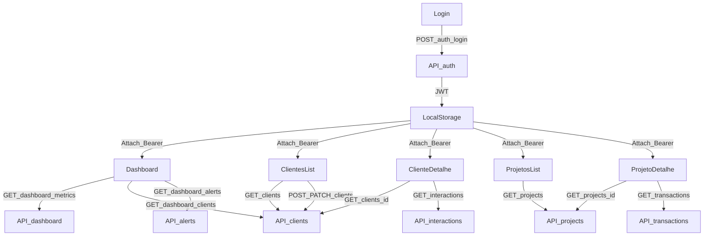

# Plano: funcionalidades detalhadas de todas as pages

## Contexto do projeto (o que existe hoje)

- Frontend é **multi-page HTML + Tailwind via CDN**.
- Pages identificadas em `frontend/src/pages/`:
  - `Dashboard/index.html`
  - `Clientes/clienteLista.html`
  - `ClienteDetalhe/client.html`
  - `Projectos/ProjectGeral.html`
  - `Projectos/projectView.html`
- Pasta `backend/` existe, mas **está vazia** neste workspace (precisa ser inicializada).

## Decisões já confirmadas

- **Arquitetura frontend**: manter HTML estático + JavaScript.
- **Dados**: implementar backend API agora.
- **Banco**: Postgres.
- **Auth**: JWT com roles (admin/operador/leitura).

## Objetivo de produto (MVP funcional)

- Transformar as páginas atuais (hoje mockadas) em telas com dados reais vindos da API.
- Garantir navegação consistente, loading/empty/error states e ações principais (CRUD essencial) por página.

## Backend (Node/Express + Prisma + Postgres)

### Estrutura proposta

- `backend/package.json` (scripts: dev, start, prisma, seed)
- `backend/src/server.ts|js` (Express, CORS, JSON, auth middleware)
- `backend/src/routes/`* e `backend/src/controllers/`*
- `backend/prisma/schema.prisma` + migrations + seed
- `.env` com `DATABASE_URL` e `JWT_SECRET`

### Modelos (Prisma)

- **User**: id, email, passwordHash, role, createdAt
- **Client**: id, code (ex: NX-90210), name, industry, region, tier, status (ACTIVE/AT_RISK/INACTIVE), healthScore, ltvTotal, churnRisk, ltvPotential, createdAt, updatedAt
- **ClientTag** (opcional no MVP): clientId, tag
- **Project**: id, code (PRJ-2024-001), name, location, region, status (ACTIVE/ON_HOLD/COMPLETED), startDate, dueDate, budgetTotal, budgetAllocated, budgetConsumed, budgetCommitted, budgetAvailable, physicalProgressPct, phaseLabel, clientId, createdAt, updatedAt
- **ProjectTransaction**: id, projectId, date, description, category (MATERIALS/EQUIPMENT/LABOR/OTHER), ownerName, status (PAID/PENDING/LATE), amount
- **InteractionEvent** (para timeline do cliente): id, clientId, type, title, description, occurredAt, leadName
- **Alert**: id, severity (HIGH/MEDIUM/LOW), title, body, createdAt, clientId?, projectId?, status (OPEN/ACK)

### Endpoints (contrato)

- **Auth**
  - `POST /auth/login` → JWT + perfil
  - `GET /auth/me` → usuário atual
- **Dashboard**
  - `GET /dashboard/metrics` → KPIs (totalClients, portfolioValue, avgHealth)
  - `GET /dashboard/clients` → “Client Matrix” (filtros + paginação)
  - `GET /dashboard/alerts` → alertas críticos
- **Clientes**
  - `GET /clients?search=&status=&industry=&sort=&page=&pageSize=`
  - `POST /clients` (admin/operador)
  - `GET /clients/:id`
  - `PATCH /clients/:id` (admin/operador)
- **Projetos**
  - `GET /projects?search=&status=&region=&dateFrom=&dateTo=&sort=&page=&pageSize=`
  - `POST /projects` (admin/operador)
  - `GET /projects/:id`
  - `PATCH /projects/:id` (admin/operador)
  - `GET /projects/:id/transactions?search=&status=&category=&page=&pageSize=`
  - `POST /projects/:id/transactions` (admin/operador)
- **Cliente timeline**
  - `GET /clients/:id/interactions`
  - `POST /clients/:id/interactions`

### Regras de auth/roles

- **leitura**: GETs.
- **operador**: GET + POST/PATCH em clientes/projetos/transações.
- **admin**: tudo (inclui gestão futura de usuários).

## Frontend (HTML + JS)

### Convenções

- Manter HTML como está, mas adicionar JS modular:
  - `frontend/src/services/api.js` (fetch wrapper, baseURL, token, tratamento de erros)
  - `frontend/src/services/auth.js` (login, logout, storage do JWT)
  - `frontend/src/shared/ui.js` (toast, modal, skeleton, empty state)
  - `frontend/src/shared/format.js` (moeda, datas, percentuais)
- Parametrização por querystring:
  - `client.html?id=<clientId>`
  - `projectView.html?id=<projectId>`

### Navegação (todas as páginas)

- Atualizar os links do topo para apontar para as páginas reais:
  - Dashboard → `../Dashboard/index.html`
  - Clientes → `../Clientes/clienteLista.html`
  - Projetos → `../Projectos/ProjectGeral.html`
- Adicionar botão “sair” (logout) e tratar 401 redirecionando para `frontend/src/pages/Auth/login.html`.

## Funcionalidades por página

### 1) Dashboard (`frontend/src/pages/Dashboard/index.html`)

- **KPIs reais**: carregar `/dashboard/metrics`.
- **Client Matrix**:
  - buscar `/dashboard/clients` com filtro de texto.
  - ação “more” vira menu: abrir detalhe do cliente, editar, marcar como “at risk/active”.
- **Critical Alerts**:
  - carregar `/dashboard/alerts`.
  - ação “investigate/draft/upgrade” leva para cliente/projeto relacionado quando existir.
- **Export Report**:
  - inicialmente export CSV/JSON via endpoint ou export no client (MVP: client-side CSV).
- **Add New Client**:
  - abrir modal com formulário e `POST /clients`.

### 2) Lista de Clientes (`frontend/src/pages/Clientes/clienteLista.html`)

- **Tabela dinâmica**:
  - `/clients` com paginação, busca, filtros (status/indústria), ordenação.
  - estados: carregando / vazio / erro.
- **Ações por linha**:
  - “Visualizar 360” abre `ClienteDetalhe/client.html?id=...`
  - “edit” abre modal e `PATCH /clients/:id`.
- **Adicionar cliente**:
  - modal com validação básica e `POST /clients`.

### 3) Cliente Detalhe (360) (`frontend/src/pages/ClienteDetalhe/client.html`)

- **Carregar header/indicadores**:
  - `GET /clients/:id`.
- **Financial Momentum**:
  - usar dados agregados do cliente (pode vir no `GET /clients/:id` ou endpoint `/clients/:id/metrics`).
- **Behavioral Engine / Insights**:
  - inicialmente derivado de campos existentes (tags + health + churn + eventos).
- **Timeline**:
  - `GET /clients/:id/interactions` e renderização; “View Full History” abre modal/lista completa.
- **FAB**:
  - ação contextual: “Adicionar interação” (POST interactions) ou “Criar projeto para este cliente”.

### 4) Projetos (lista) (`frontend/src/pages/Projectos/ProjectGeral.html`)

- **Tabela real**:
  - `GET /projects` com filtros status/região/período, ordenação.
- **Operações**:
  - menu “more_vert”: abrir detalhe (`projectView.html?id=...`), editar, alterar status.
- **Add New Project**:
  - modal com seleção de cliente (autocomplete em `/clients?search=`) e `POST /projects`.

### 5) Projeto Detalhe (`frontend/src/pages/Projectos/projectView.html`)

- **Resumo financeiro e progresso**:
  - `GET /projects/:id`.
- **Curva S vs Realizado**:
  - MVP: endpoint que devolve série mensal planejado vs executado (ou mock derivado de transações).
- **Status de operação**:
  - abastecer com campos do projeto (ou subentidades futuras).
- **Lançamentos recentes**:
  - `GET /projects/:id/transactions` + busca/filtro.
  - “Novo Lançamento” abre modal e `POST /projects/:id/transactions`.
- **Exportar relatório**:
  - endpoint `/projects/:id/report` (PDF/CSV) ou client-side CSV no MVP.

## Página adicional necessária por causa do JWT

- Criar `frontend/src/pages/Auth/login.html`:
  - formulário email/senha → `POST /auth/login`.
  - salvar token (localStorage), redirecionar para Dashboard.

## Diagrama (fluxo de dados por page)

## Critérios de pronto (por page)

- Carrega dados reais via API.
- Filtros funcionam e refletem URL (querystring) quando aplicável.
- Estados de UI: loading, empty, erro.
- Ações principais (criar/editar) com validação mínima e feedback.
- Proteção por JWT (401 → login).

