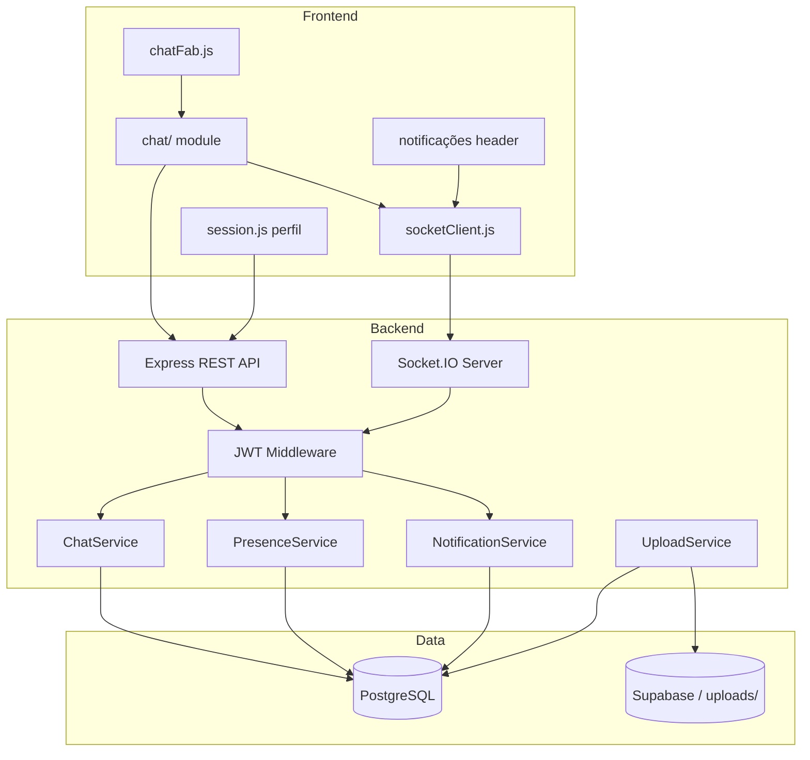

# Plano de Arquitectura: Módulo de Comunicação e Perfil

## Contexto actual

| Camada | Estado |
|--------|--------|
| **Frontend** | Multi-page HTML + JS modular (`shared/`, `services/`). FAB global injectado via `chatFab.js` + `wireUsersNav()`. |
| **Backend** | Express + JWT + Prisma + PostgreSQL. Upload via `storage.js` (Supabase ou local). Sem WebSocket. |
| **User** | Modelo `User` com `name`, `email`, `role`, `profilePic`, `createdAt`. Perfil editável via `PATCH /users/me`. |
| **Interações cliente** | `InteractionEvent` — timeline por cliente (não é chat entre utilizadores). Mantido separado do novo módulo. |

## Visão de arquitectura



## Decisões técnicas

| Decisão | Escolha | Justificação |
|---------|---------|--------------|
| Tempo real | **Socket.IO** sobre HTTP upgrade | Reconexão automática, rooms, fallback polling; integra bem com Express existente. |
| Presença | Redis opcional (fase 2+) ou PostgreSQL + heartbeat | MVP com `user_presence` + TTL 60s; Redis se escala > 500 utilizadores simultâneos. |
| Fotos | Reutilizar `uploadToSupabase()` | Já usado em stock/projetos; path `uploads/avatars/{userId}.webp`. |
| Permissões | Extender `permissionsCatalog.js` | Módulo `chat` com acções `read`, `send`, `create_group`. |
| Compatibilidade | Não remover `InteractionEvent` | Chat interno ≠ histórico comercial do cliente. |

---

## Fase 0 — Fundação (em curso)

### Entregáveis concluídos
- [x] `frontend/src/shared/chatFab.js` — FAB + painel shell em todas as páginas autenticadas
- [x] Integração via `wireUsersNav()` em `session.js`
- [x] Botão "Nova Interação" preservado em `ClienteDetalhe/client.html` (funcionalidade existente)
- [x] Remoção de FABs duplicados em Dashboard e lista de clientes

### Próximos passos imediatos
1. Instalar `socket.io` + `socket.io-client` no backend/frontend
2. Criar `backend/src/socket/` com auth JWT no handshake
3. Adicionar módulo `chat` ao catálogo de permissões

---

## Fase 1 — Base de Dados

### Novos modelos Prisma

```prisma
model UserProfile {
  id          String   @id @default(cuid())
  userId      String   @unique
  phone       String?
  jobTitle    String?
  bio         String?
  updatedAt   DateTime @updatedAt
  user        User     @relation(fields: [userId], references: [id], onDelete: Cascade)
}

enum PresenceStatus {
  ONLINE
  AWAY
  OFFLINE
}

model UserPresence {
  userId      String         @id
  status      PresenceStatus @default(OFFLINE)
  lastSeenAt  DateTime       @default(now())
  user        User           @relation(fields: [userId], references: [id], onDelete: Cascade)
}

enum ConversationType {
  DIRECT
  GROUP
}

model Conversation {
  id           String                   @id @default(cuid())
  type         ConversationType         @default(DIRECT)
  title        String?
  createdAt    DateTime                 @default(now())
  updatedAt    DateTime                 @updatedAt
  participants ConversationParticipant[]
  messages     Message[]
  @@index([updatedAt])
}

model ConversationParticipant {
  id             String       @id @default(cuid())
  conversationId String
  userId         String
  joinedAt       DateTime     @default(now())
  lastReadAt     DateTime?
  conversation   Conversation @relation(fields: [conversationId], references: [id], onDelete: Cascade)
  user           User         @relation(fields: [userId], references: [id], onDelete: Cascade)
  @@unique([conversationId, userId])
  @@index([userId])
}

enum MessageStatus {
  SENT
  DELIVERED
  READ
}

model Message {
  id             String        @id @default(cuid())
  conversationId String
  senderId       String
  body           String
  status         MessageStatus @default(SENT)
  createdAt      DateTime      @default(now())
  editedAt       DateTime?
  conversation   Conversation  @relation(fields: [conversationId], references: [id], onDelete: Cascade)
  sender         User          @relation(fields: [senderId], references: [id])
  reads          MessageRead[]
  mentions       Mention[]
  attachments    MessageAttachment[]
  @@index([conversationId, createdAt])
}

model MessageRead {
  id        String   @id @default(cuid())
  messageId String
  userId    String
  readAt    DateTime @default(now())
  message   Message  @relation(fields: [messageId], references: [id], onDelete: Cascade)
  user      User     @relation(fields: [userId], references: [id], onDelete: Cascade)
  @@unique([messageId, userId])
}

model Mention {
  id              String   @id @default(cuid())
  messageId       String
  mentionedUserId String
  message         Message  @relation(fields: [messageId], references: [id], onDelete: Cascade)
  mentionedUser   User     @relation("MentionsReceived", fields: [mentionedUserId], references: [id])
  @@index([mentionedUserId])
}

enum NotificationType {
  NEW_MESSAGE
  MENTION
  REQUEST
  APPROVAL
  SYSTEM
}

model Notification {
  id        String           @id @default(cuid())
  userId    String
  type      NotificationType
  title     String
  body      String?
  link      String?
  read      Boolean          @default(false)
  metadata  Json?
  createdAt DateTime         @default(now())
  user      User             @relation(fields: [userId], references: [id], onDelete: Cascade)
  @@index([userId, read, createdAt])
}

model MessageAttachment {
  id        String  @id @default(cuid())
  messageId String
  fileName  String
  mimeType  String
  size      Int
  path      String
  message   Message @relation(fields: [messageId], references: [id], onDelete: Cascade)
}
```

### Alterações ao modelo `User` existente
- Manter `profilePic` no `User` (já existe)
- Adicionar relações: `profile`, `presence`, `participants`, `messages`, `notifications`, `mentionsReceived`

### Índices críticos
- `(conversationId, createdAt DESC)` — histórico paginado
- `(userId, read, createdAt DESC)` — inbox de notificações
- `(mentionedUserId)` — feed de menções

---

## Fase 2 — Tempo Real (Socket.IO)

### Estrutura backend

```
backend/src/
  socket/
    index.js          # attach ao http.Server
    auth.js           # verify JWT no handshake
    handlers/
      chat.js         # message:send, message:read, typing
      presence.js     # presence:update, presence:subscribe
      notifications.js
```

### Eventos WebSocket

| Evento (cliente → servidor) | Payload | Acção |
|-----------------------------|---------|-------|
| `conversation:join` | `{ conversationId }` | Entrar na room |
| `message:send` | `{ conversationId, body, mentionIds? }` | Persistir + broadcast |
| `message:read` | `{ conversationId, messageId }` | Actualizar MessageRead |
| `typing:start` / `typing:stop` | `{ conversationId }` | Broadcast à room |
| `presence:heartbeat` | `{}` | Actualizar UserPresence |

| Evento (servidor → cliente) | Payload |
|---------------------------|---------|
| `message:new` | Message + sender profile |
| `message:status` | `{ messageId, status }` |
| `typing:update` | `{ userId, isTyping }` |
| `presence:changed` | `{ userId, status, lastSeenAt }` |
| `notification:new` | Notification |

### Regras de presença
- **Online**: heartbeat nos últimos 60s
- **Ausente**: sem heartbeat 60–300s (ainda conectado Socket)
- **Offline**: desconexão ou > 300s sem actividade

### Frontend: `frontend/src/services/socketClient.js`
- Singleton com reconexão exponencial
- Token JWT no `auth` do handshake
- Event bus simples para `chatFab.js` e futuros componentes

---

## Fase 3 — API REST de Mensagens

### Endpoints

| Método | Rota | Descrição |
|--------|------|-----------|
| GET | `/conversations` | Lista conversas do utilizador (com última msg, unread count) |
| POST | `/conversations` | Criar direct ou grupo `{ participantIds, title? }` |
| GET | `/conversations/:id/messages?cursor=&limit=50` | Histórico paginado |
| POST | `/conversations/:id/messages` | Enviar (fallback REST se WS offline) |
| PATCH | `/conversations/:id/read` | Marcar todas como lidas |
| GET | `/users/search?q=` | Autocomplete para menções e nova conversa |

### Validação (Zod)
- `body`: max 4000 chars, sanitizar HTML
- Participantes: verificar que existem e utilizador tem permissão

### Auditoria
- `SystemLog` com `module: "chat"`, acções `SEND_MESSAGE`, `CREATE_CONVERSATION`

---

## Fase 4 — Perfil e Upload de Foto

### Expandir `GET/PATCH /users/me`

```json
{
  "id", "email", "name", "role", "profilePic", "createdAt",
  "profile": { "phone", "jobTitle", "bio" },
  "presence": { "status", "lastSeenAt" }
}
```

### Novo endpoint

| Método | Rota | Descrição |
|--------|------|-----------|
| POST | `/users/me/avatar` | multipart/form-data, max 2MB, JPG/PNG/WebP |

### Fluxo de upload
1. Validar MIME + tamanho no backend (multer ou busboy)
2. Opcional: redimensionar para 256×256 (sharp)
3. `uploadToSupabase("avatars/{userId}.{ext}", buffer, mime)`
4. Actualizar `User.profilePic`
5. Emitir `user:profile_updated` via Socket para actualizar avatares em tempo real

### UI — modal "O Meu Perfil" (`session.js`)
- Avatar com preview + botão "Alterar foto"
- Campos: nome, cargo, telefone, email (readonly), estado presença (readonly)
- Data de criação da conta
- Secção alterar palavra-passe (existente)

### Componente reutilizável: `shared/userAvatar.js`
```js
renderUserAvatar({ userId, name, profilePic, size, showPresence })
```
Usar em: chat, nav, comentários, lista de utilizadores.

---

## Fase 5 — Sistema de Menções (@)

### Frontend
- Listener `input` no campo de mensagem: ao detectar `@`, abrir dropdown
- `GET /users/search?q=` com debounce 200ms
- Inserir `@Nome` + guardar `mentionIds` no envio
- Render: regex `/@\[([^\]]+)\]\(([^)]+)\)/g` → `<a data-user-id>` com highlight

### Backend
- Ao persistir mensagem, criar registos `Mention`
- Emitir `notification:new` tipo `MENTION`
- Indexar menções por utilizador para feed futuro

---

## Fase 6 — Notificações

### Tipos integrados com módulos existentes

| Tipo | Origem | Exemplo |
|------|--------|---------|
| `NEW_MESSAGE` | Chat | "João enviou uma mensagem" |
| `MENTION` | Chat | "Foi mencionado em #Obra-X" |
| `REQUEST` | WorkNeed / DailyPlan | "Novo pedido de material" |
| `APROVAL` | MeasurementReport / CostPayment | "Relatório aprovado" |
| `SYSTEM` | Alert | "Alerta de risco no cliente X" |

### UI
- Ícone sino no navbar (`data-notifications`)
- Dropdown com lista + "Marcar todas como lidas"
- Badge sincronizado com `setChatUnreadCount()` no FAB (mensagens) e contador separado (outros eventos)

### API

| Método | Rota |
|--------|------|
| GET | `/notifications?unreadOnly=true` |
| PATCH | `/notifications/:id/read` |
| PATCH | `/notifications/read-all` |

---

## Fase 7 — Interface do Chat

### Layout do painel (`chatFab.js` → `chat/panel.js`)

```
┌─────────────────────────────────────┐
│ Header: Mensagens          [×]      │
├──────────────┬──────────────────────┤
│ Conversas    │  Cabeçalho conversa  │
│ [pesquisa]   │  Avatar + nome + 🟢    │
│              ├──────────────────────┤
│ ○ João       │  Mensagens (scroll)  │
│   "Olá..."   │                      │
│ ○ Equipa Obra│  [typing...]         │
│              ├──────────────────────┤
│              │ [@] [📎] [input] [➤] │
└──────────────┴──────────────────────┘
```

### Responsividade
- **Desktop**: painel lateral 420px (actual)
- **Tablet**: painel 90vw
- **Mobile**: fullscreen overlay com botão voltar

### Funcionalidades opcionais (fase 7b)
- Picker de emojis (emoji-mart ou nativo)
- Drag & drop de anexos (reutilizar `apiUpload`)

### Ficheiros frontend propostos

```
frontend/src/
  shared/
    chatFab.js          # FAB + mount point (existente)
    userAvatar.js       # avatar reutilizável
  chat/
    panel.js            # lógica do painel
    conversations.js    # lista + pesquisa
    thread.js           # área de mensagens
    composer.js         # input + menções + envio
    mentionAutocomplete.js
  services/
    socketClient.js
    chatApi.js
    notificationsApi.js
```

---

## Fase 8 — Integração e Qualidade

### Propagação de avatar
- Navbar: `[data-user-profile]` com mini avatar
- `Users/index.html`: coluna foto
- Comentários stock/interacções: `renderUserAvatar`
- Evento `user:profile_updated` via Socket

### Testes
- Unit: parsing de menções, estados de presença
- Integração: envio msg → persist → broadcast
- E2E: login → abrir chat → enviar → receber noutro browser

### Documentação
- `backend/README.md`: secção WebSocket + variáveis de ambiente
- Diagrama de eventos no `.plans/`
- Changelog por fase

---

## Cronograma sugerido

| Fase | Duração estimada | Dependências |
|------|------------------|--------------|
| 0 — Fundação | 2–3 dias | — |
| 1 — BD | 2 dias | Fase 0 |
| 2 — WebSocket | 4–5 dias | Fase 1 |
| 3 — API mensagens | 3 dias | Fase 1 |
| 4 — Perfil/upload | 3 dias | Fase 1 |
| 5 — Menções | 2 dias | Fases 3, 4 |
| 6 — Notificações | 3 dias | Fases 2, 5 |
| 7 — UI chat | 5–7 dias | Fases 2, 3, 4 |
| 8 — Integração | 3 dias | Todas |

**Total estimado: 4–6 semanas** (1 dev full-stack)

---

## Riscos e mitigações

| Risco | Mitigação |
|-------|-----------|
| IIS/Windows hosting sem WebSocket | Configurar `web.config` para upgrade; fallback long-polling Socket.IO |
| Conflito FAB com toasts (bottom-right) | FAB em `bottom-8 right-8`, toasts em `bottom-6 left-1/2` ou `bottom-24` |
| Permissões cliente vs interno | Conversas directas: cliente só com operadores atribuídos ao seu `clientId` |
| Performance histórico longo | Paginação cursor-based; carregar 50 msgs por vez |

---

## Critérios de aceitação (MVP)

- [ ] Mensagem enviada aparece instantaneamente no destinatário sem refresh
- [ ] Avatar actualizado reflecte-se em chat, nav e perfil em < 2s
- [ ] Menção `@` gera notificação e highlight clicável
- [ ] Presença online/ausente/offline actualiza automaticamente
- [ ] Contador de não lidas no FAB e sino do header
- [ ] Funcionalidades existentes (InteractionEvent, stock, obras) intactas
- [ ] Responsivo em mobile, tablet e desktop
