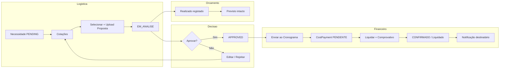

# Plano de Implementação — Reunião BG / Plano de Pagamentos

> **Estado (Jul 2026):** Fases **A + B (núcleo)** implementadas no código — ver secção **10**.

> **Origem:** transcrição da reunião `reunia BG PP.mp4` (~40 min, Jul 2026) + estado actual do código InforCliente.  
> **Complementa:** `Plano de Evolução Financeira e Logística InforCliente.md` (fases 1–6 já parcialmente entregues).  
> **Objectivo:** alinhar fluxo Logística → Orçamento → Financeiro com as regras acordadas na reunião, corrigir ambiguidades de estado e fechar lacunas de UX.

---

## 1. Resumo executivo

A reunião definiu um fluxo mais claro em três camadas financeiras:

| Camada | Significado | Quando entra |
|---|---|---|
| **Previsto** | Orçamento base (Excel/BoQ), **fixo** | Upload inicial |
| **Realizado** | Preço comprometido após cotação/selecção | Selecção de proposta + upload |
| **Liquidado** | Valor efetivamente pago | Liquidação com comprovativo |

**Princípios acordados:**

1. Selecção de proposta na logística → item cotado → entra no **realizado**, mas pagamento continua **pendente**.
2. Estado **«Em análise»** entre cotação e decisão final — evitar «Aprovado» prematuro.
3. Só após decisão → envio ao **cronograma de pagamentos** (financeiro agenda data e forma).
4. **Comprovativo obrigatório** na liquidação + notificação a destinatário escolhido.
5. **Transferências internas** e despesas fixas **não passam pela logística**.
6. **Transportador** = fornecedor genérico com **rateio de frete** entre obras/produtos.
7. **IVA/retenção** calculam valor bruto automaticamente; **não entram** no realizado orçamental.
8. **Vista tabular** de pagamentos além do Gantt (quadro operacional «pago / pendente»).

---

## 2. Diagnóstico: o que já existe vs. o que falta

| # | Regra (reunião) | Estado actual | Gap |
|---|---|---|---|
| 1 | Upload proposta na cotação (logística) | Proforma opcional ao criar cotação; fluxo principal exige encomenda + proforma depois | Fluxo dedicado «selecionar fornecedor + upload proposta» |
| 2 | Realizado na selecção, pagamento pendente | Realizado só com `ORDERED`/`APPROVED` via proforma | Mover realizado para `select` + upload |
| 3 | Estado «Em análise» | Proforma → `APPROVED` directo | Novo estado `EM_ANALISE` / label UI |
| 4 | Envio ao cronograma após decisão | Manual (`schedule`) ou auto só em crédito | Acção explícita «Enviar ao Financeiro» + auto opcional |
| 5 | Previsto / realizado / liquidado por linha | Previsto×real no CC; liquidado via pagamentos | 3.ª coluna liquidado integrada na vista orçamental |
| 6 | Vista tabular no Perfil Financeiro | Gantt OK; `renderPlanTable()` órfão no JS | Tab «Lista» com colunas pedidas |
| 7 | Transportador + rateio frete | Só categoria `TRANSPORTE` manual | Modelo de frete partilhado |
| 8 | IVA/retenção → bruto automático | Percentagens informativas no fornecedor | Cálculo bidireccional no pagamento |
| 9 | Comprovativo obrigatório | Frontend valida; backend não rejeita | Validação server-side |
| 10 | Transferências bypass logística | ✅ `POST /stock/transfer` | — |
| 11 | Auditoria de faturas | Backend completo; UI removida | Decidir se reactivar ou manter só backend |
| 12 | Data recepção em obra | Não implementado | **Fase posterior** (reunião disse «não agora») |
| 13 | Integração cronograma obra ↔ pagamentos | Não existe | **Fase posterior** |

---

## 3. Arquitectura do fluxo alvo



**Regra de ouro:** «Realizado» ≠ «Liquidado». «Aprovado» ≠ «Pago».

---

## 4. Roadmap por fases

Ordem optimizada: **quick wins de UX e estados primeiro**, depois fluxo logístico, depois frete/fiscal avançado.

---

### Fase A — Estados e linguagem (1–2 semanas)

**Objectivo:** eliminar ambiguidade «Aprovado = já pago» e alinhar labels com a reunião.

#### Backend

| Alteração | Ficheiro(s) |
|---|---|
| Adicionar `EM_ANALISE` ao enum `NeedStatus` (Prisma) | `schema.prisma` |
| Migração: needs com proforma upload mas sem decisão final → `EM_ANALISE` | migration SQL |
| `PATCH /quotes/:id/select` + upload proposta → `EM_ANALISE`, gravar `quotedPrice` em realizado | `quotes.js`, `needBudgetService.js` |
| Endpoint `PATCH /quotes/:id/approve-analysis` → `APPROVED` | `quotes.js` |
| Endpoint `PATCH /quotes/:id/reject-analysis` → `IN_QUOTATION` ou `REJECTED` | `quotes.js` |
| Separar labels API: `CONFIRMADO` → «Liquidado» (já parcial) | `paymentTimelineService.js` |

#### Frontend

| Alteração | Ficheiro(s) |
|---|---|
| Badge «Em análise» (âmbar) em cotações e CC | `centroCustos.js`, `cotacao.js`, `quotePricingModal.js` |
| Renomear «Aprovado» onde significa «decisão tomada, ainda não pago» | Stock, CC, Financeiro |
| KPI «Total liquidado» no dashboard só soma `CONFIRMADO` | `financeiro.js`, summary API |
| «Total realizado» no orçamento **não** incluir itens só em análise (configurável) | `needBudgetService.js` |

#### Critério de conclusão

- [ ] Utilizador vê «Em análise» entre selecção e aprovação final.
- [ ] «Liquidado» só aparece após comprovativo.
- [ ] Dashboard financeiro distingue previsto / realizado / liquidado nos KPIs.

---

### Fase B — Fluxo logístico: selecção + proposta (2–3 semanas)

**Objectivo:** implementar o fluxo acordado «selecção da proposta + upload → realizado, pagamento pendente».

#### Backend

| Alteração | Detalhe |
|---|---|
| Novo passo `POST /quotes/:id/submit-proposal` | Requer `selected=true`, ficheiro proposta, grava `proposalUrl`, estado → `EM_ANALISE` |
| `select` deixa de ser só flag | Opcionalmente exige proposta no mesmo request (multipart) |
| Realizado orçamental | Ao submit: `unitPrice = quotedPrice`, preservar `originalUnitPrice` |
| Permissão | `logistica:full_access` ou `cotacao:approve` para submit |

#### Frontend — Logística (`Stock/`)

| Alteração | Detalhe |
|---|---|
| Modal «Selecionar fornecedor» | Upload obrigatório de proposta/PDF |
| Lista de cotações por necessidade | Estado, fornecedor, valor, link proposta |
| Acções: «Submeter para análise», «Aprovar», «Rejeitar» | Conforme perfil |

#### Frontend — Cotação (`Cotacao/`)

| Alteração | Detalhe |
|---|---|
| Alinhar fluxo com Stock (mesma API) | Evitar dois fluxos divergentes |
| Documento de justificativa da selecção | Metadados: quem seleccionou, quando, ficheiro |

#### Critério de conclusão

- [ ] Logística faz upload da proposta **no momento da selecção**.
- [ ] Item aparece no orçamento realizado com preço da proposta.
- [ ] Pagamento continua inexistente ou `PENDENTE` até envio ao cronograma.

---

### Fase C — Ponte Logística → Financeiro (2 semanas)

**Objectivo:** após aprovação, encaminhar item ao cronograma com dados completos (fornecedor, proforma, forma de pagamento).

#### Backend

| Alteração | Detalhe |
|---|---|
| `POST /cost-centers/:id/needs/:needId/send-to-finance` | Cria `CostPayment` `PENDENTE` com dados da cotação aprovada |
| Payload inclui | `supplierId`, `budgetedAmount`, `paymentType`, `proformaUrl`, `description` |
| Notificação `PAYMENT_CREATED` | Destinatários `isFinancialReceiver` (ex.: Bruna) |
| Regra crédito | Manter auto-geração de parcelas em `confirm-invoice`; pronto pagamento usa novo endpoint |
| Validação | Só needs `APPROVED` + cotação `selected` + proposta anexada |

#### Frontend

| Alteração | Ficheiro(s) |
|---|---|
| Botão «Enviar ao Financeiro» no CC e Stock | Visível só para `APPROVED` |
| Modal confirmação | Resumo: fornecedor, valor, forma, obra |
| Fila «Pedidos para Pagamento» | Incluir needs aprovados ainda não agendados |
| Financeiro recebe e agenda data | Reutilizar modal existente de cronograma |

#### Critério de conclusão

- [ ] Item aprovado pode ser enviado ao financeiro num clique.
- [ ] Financeiro vê pedido com proposta, fornecedor e valor.
- [ ] Após agendamento, aparece no Gantt do Plano de Pagamentos.

---

### Fase D — Vista tabular no Perfil Financeiro (1 semana)

**Objectivo:** «quadro» operacional pedido na reunião — além do Gantt.

#### Frontend (`financeiro.html` + `financeiro.js`)

| Coluna | Fonte |
|---|---|
| Material / Descrição | `CostPayment.description` / need |
| Fornecedor | `supplierName` |
| Obra | `project.name` |
| Valor | `budgetedAmount` / `paidAmount` |
| Proforma | link / ícone |
| Forma pagamento | `paymentType` |
| Data prevista | `paymentDate` |
| Estado | Pendente / Atrasado / Liquidado |
| Acções | Ver detalhe, Liquidar |

| Alteração | Detalhe |
|---|---|
| 3.ª sub-aba ou toggle | «Calendário» | «Lista» | «Pedidos» |
| Reutilizar `renderPlanTable()` | Ligar a `#planTableBody` no HTML |
| Filtros partilhados | Obra, estado, pesquisa (já existem no dashboard) |
| Marcar «pago» linha a linha | Acção liquidar inline ou via aside |

#### Critério de conclusão

- [ ] Utilizador alterna entre Gantt e tabela no Perfil Financeiro.
- [ ] Tabela mostra colunas acordadas na reunião.
- [ ] Liquidação possível a partir da linha.

---

### Fase E — Liquidação robusta + notificações (1 semana)

**Objectivo:** comprovativo obrigatório também no backend; notificação consistente.

#### Backend

| Alteração | Ficheiro(s) |
|---|---|
| `PATCH …/payments/:payId` rejeita sem `comprovativoUrl` (ou ficheiro no request) | `costCenters.js` |
| Manter excepção | Substituição de comprovativo em re-liquidação (se permitido) |
| `notifyUserIds` obrigatório ou default para receivers | `paymentNotificationService.js` |
| Evento `PAYMENT_CONFIRMED` sempre dispara | Já existe — validar cobertura |

#### Frontend

| Alteração | Detalhe |
|---|---|
| Manter validação client-side | `paymentDetailAside.js` |
| Destinatários pré-seleccionados | Receivers financeiros da obra |
| Feedback claro se backend rejeitar | Toast com motivo |

#### Critério de conclusão

- [ ] API recusa liquidação sem comprovativo.
- [ ] Destinatário recebe notificação in-app com link ao comprovativo.

---

### Fase F — IVA, retenção e valor bruto (2 semanas)

**Objectivo:** cálculo automático bruto ↔ líquido; fiscal fora do realizado.

#### Backend

| Alteração | Detalhe |
|---|---|
| Campos em `CostPayment` (opcional) | `grossAmount`, `vatAmount`, `withholdingAmount`, `netAmount` |
| Serviço `fiscalCalculationService.js` | Dado bruto + % fornecedor → líquido; inverso também |
| `budgetedAmount` / realizado | Continua a usar **base sem IVA/retenção** |
| Fornecedor regime geral | `vatPercent` aplica a todos os produtos desse fornecedor |

#### Frontend

| Alteração | Ficheiro(s) |
|---|---|
| Expandir `supplierFiscal.js` | Modo «introduzir bruto» vs «introduzir base» |
| Checkboxes por linha | «Tem IVA», «Retenção na fonte» |
| Aside liquidação | Breakdown fiscal informativo (já parcial) |
| Pagamento | Valor a pagar = líquido; realizado orçamental = base |

#### Critério de conclusão

- [ ] Utilizador introduz valor bruto e sistema calcula IVA/retenção.
- [ ] Orçamento realizado compara base com base (sem fiscal).
- [ ] Liquidação regista valor pago líquido + breakdown.

---

### Fase G — Transportador e rateio de frete (3–4 semanas)

**Objectivo:** frete como fornecedor genérico; um transporte, várias obras/produtos.

#### Modelo de dados (proposta)

```prisma
model FreightOrder {
  id            String   @id @default(cuid())
  supplierId    String   // transportador
  totalAmount   Float
  status        FreightStatus // PENDENTE, EM_ANALISE, APPROVED, PAGO
  notes         String?
  allocations   FreightAllocation[]
}

model FreightAllocation {
  id            String   @id @default(cuid())
  freightOrderId String
  needQuoteId   String?  // encomenda origem
  projectId     String
  description   String   // ex.: "Frete poste - Obra X"
  amount        Float
}
```

#### Backend

| Alteração | Detalhe |
|---|---|
| `Supplier.type` enum | `MATERIAL`, `SERVICO`, `TRANSPORTADOR` |
| CRUD frete + alocações | Novas rotas `/freight-orders` |
| Rateio | Soma alocações = total; validação |
| Pagamento | Gera `CostPayment` categoria `TRANSPORTE` ou frete agregado |
| UI CC | «Adicionar frete» ao seleccionar transportador |

#### Frontend

| Alteração | Detalhe |
|---|---|
| Modal rateio | Seleccionar produtos/encomendas de várias obras |
| Transportador vê lista de «produtos» (tipos frete) | Poste, travessa, transformador |
| Integração cronograma | Frete aprovado → envio financeiro |

#### Critério de conclusão

- [ ] Um único frete pode cobrir material de 2+ obras.
- [ ] Valor rateado por linha/produto.
- [ ] Transportador registado como fornecedor tipo transportador.

---

### Fase H — Orçamento geral consolidado (2 semanas)

**Objectivo:** visão previsto × realizado × liquidado por obra e global, com desvio.

#### Backend

| Alteração | Detalhe |
|---|---|
| `GET /projects/:id/budget-summary` | `previsto`, `realizado`, `liquidado`, `desvio%` |
| Realizado | Σ needs `EM_ANALISE` + `APPROVED` + `ORDERED` (definir regra exacta com negócio) |
| Liquidado | Σ `CostPayment.CONFIRMADO` |
| Previsto | Baseline congelado (`ProjectBudgetLine` / `originalUnitPrice`) |

#### Frontend

| Alteração | Ficheiro(s) |
|---|---|
| Dashboard obra | 3 KPIs lado a lado |
| CC toggle | Previsto / Realizado / Liquidado |
| Gráfico desvio | Barra ou donut (já parcial no financeiro) |

#### Critério de conclusão

- [ ] Gestor vê desvio previsto→realizado e realizado→liquidado.
- [ ] «Total liquidado» no orçamento geral só após pagamento confirmado.

---

### Fase I — Itens em fase posterior (backlog)

| Item | Motivo (reunião) | Dependências |
|---|---|---|
| Data de recepção em obra | Pedido levantado mas adiado | Fase C |
| Cronograma obra ↔ data pagamento | «Podemos pensar posterior» | Integração planeamento |
| Envio e-mail automático p/ arquivo documental | Mencionado no final | Fase E + config SMTP |
| Reactivar UI Auditoria de Faturas | Removida; backend existe | Decisão de produto |
| `NeedStatus.PAID` automático na liquidação | Enum existe, transição em falta | Fase C/E |

---

## 5. Matriz de dependências

```
Fase A (estados) ──► Fase B (proposta logística) ──► Fase C (→ financeiro)
        │                                                    │
        └──────────────────► Fase H (orçamento 3 colunas) ◄──┘
        
Fase D (tabela) ── independente, paralelo após A
Fase E (liquidação) ── independente, paralelo
Fase F (IVA) ── após C (pagamentos estáveis)
Fase G (frete) ── após B + C
Fase I ── backlog
```

**Sprint sugerido (8 semanas):**

| Semana | Entregas |
|---|---|
| 1 | Fase A |
| 2–3 | Fase B |
| 4 | Fase C + D |
| 5 | Fase E + início F |
| 6–7 | Fase F + G (MVP rateio) |
| 8 | Fase H + testes integrados |

---

## 6. Decisões a confirmar com negócio

Antes de codificar Fases B, C e H:

1. **Realizado inclui «Em análise»?** — Reunião disse sim (preço já definido); confirmar se entra no total realizado antes da aprovação final.
2. **Rejeição em análise** — Volta a cotação aberta ou fecha a necessidade?
3. **Envio ao financeiro** — Automático na aprovação ou sempre manual (botão)?
4. **Frete** — Um `CostPayment` por frete ou um por alocação?
5. **IVA** — No fornecedor (actual) ou também override por produto?
6. **Auditoria** — Reactivar separador no Financeiro ou manter só API?

---

## 7. Testes de aceitação (cenários E2E)

| # | Cenário | Resultado esperado |
|---|---|---|
| T1 | Logística selecciona fornecedor + upload proposta | Need → `EM_ANALISE`, realizado actualizado, sem pagamento |
| T2 | Aprova análise | Need → `APPROVED`, ainda sem pagamento |
| T3 | Envia ao financeiro | `CostPayment` `PENDENTE` na fila; notificação receiver |
| T4 | Financeiro agenda data | Aparece no Gantt e na tabela |
| T5 | Liquida sem comprovativo | API 400; UI bloqueia |
| T6 | Liquida com comprovativo | `CONFIRMADO`, notificação, liquidado sobe no KPI |
| T7 | Cancela item em análise | Realizado revertido; previsto intacto |
| T8 | Frete 2 obras | Rateio correcto; 1 pagamento transportador |
| T9 | Transferência interna stock | Sem passar por cotação/encomenda |
| T10 | Dashboard obra | Previsto ≠ Realizado ≠ Liquidado visíveis |

---

## 8. Ficheiros principais a alterar

| Fase | Backend | Frontend |
|---|---|---|
| A | `schema.prisma`, `quotes.js`, `needBudgetService.js` | `centroCustos.js`, `cotacao.js`, `financeiro.js` |
| B | `quotes.js` | `Stock/stock.js`, `quotePricingModal.js` |
| C | `costCenters.js`, `paymentNotificationService.js` | `centroCustos.js`, `financeiro.js` |
| D | — | `financeiro.html`, `financeiro.js` |
| E | `costCenters.js` | `paymentDetailAside.js` |
| F | novo `fiscalCalculationService.js`, `costCenters.js` | `supplierFiscal.js`, modais liquidação |
| G | novo `freightOrders.js`, `schema.prisma` | `Stock/stock.js`, modal rateio |
| H | `costCenters.js`, `projects.js` | `centroCustos.js`, `financeiro.js` |

---

## 9. Conclusão

O sistema já tem **~70% da infraestrutura** (previsto/real, Perfil Financeiro, Gantt, entregas, notificações, certificação backend). O trabalho restante concentra-se em **fechar o fluxo de estados** («Em análise» → aprovação → cronograma), **UX operacional** (tabela de pagamentos), **validações server-side** e **domínios novos** (frete rateado, fiscal automático).

Prioridade imediata recomendada: **Fases C → D** — envio ao financeiro e vista tabular.

---

## 10. Registo de implementação

| Fase | Estado | Notas |
|---|---|---|
| **A — Estados e linguagem** | ✅ Entregue | `EM_ANALISE` no Prisma; labels «Em Análise»; agendar só após `APPROVED` |
| **B — Proposta na cotação** | ✅ Entregue | Upload proposta → realizado + `EM_ANALISE`; aprovar/rejeitar análise |
| **C — Ponte → Financeiro** | ⏳ Pendente | Botão «Enviar ao Financeiro», fila unificada |
| **D — Vista tabular** | ⏳ Pendente | Tab «Lista» no Perfil Financeiro |
| **E–I** | ⏳ Pendente | Ver roadmap acima |

**Migration:** `backend/prisma/migrations/20260720100000_need_status_em_analise/` — executar `npx prisma migrate deploy` no backend antes de testar.
